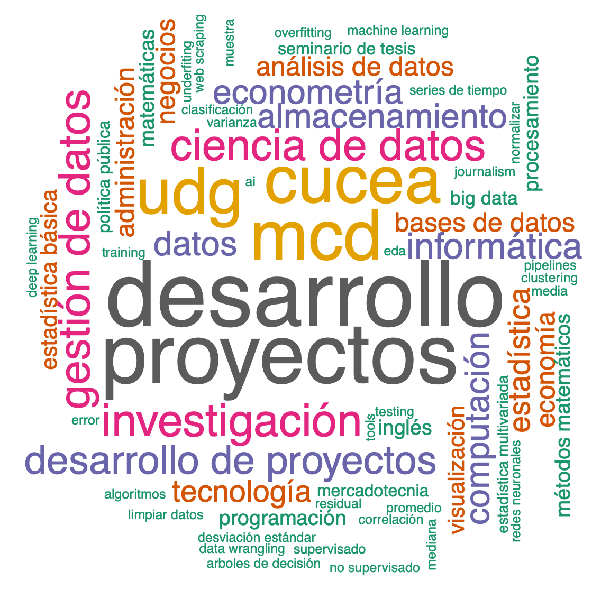

# Project Development II
_Complementary material for the course Desarrollo de Proyectos II (Project Development II) of the Master of Data Science at Universidad de Guadalajara._

_⚠️ Note: the material of this repository would be shared mainly in Spanish._

## Detalles de la materia

### Curso
Nombre: Desarrollo de Proyectos II
NRC: 182400
Clave: IH602
Ciclo escolar: 2022-B (sem. otoño)
Horario: Miércoles de 18:00 a 21:00 hr.
Fechas: de agosto a diciembre 2022

### Profesor

Cualquier duda, aclaración o comentario sobre el material de este repositorio pueden contactarme a través de los siguientes canales:

|Nombre |e-mail |GitHub user| Página web |
|:----:|:----:|:-----:|:-----:|
|VICTOR CUSPINERA | vcuspinera@gmail.com | [vcuspinera](https://github.com/vcuspinera) |  |

### Alumnos
Lista de alumnos del ciclo escolar 2022-B (semestre de otoño).

|Id. UDG |Nombre |e-mail UDG |e-mail alternativo |GitHub user| 
|:----:|:----:|:----:|:-----:|
|213388296 |CAROL MIROSLAVA CASTAÑEDA MARTINEZ |carol.castaneda3882@alumnos.udg.mx | |
|221310808 |JORGE GOMEZ CERVANTES |jorge.gomez1080@alumnos.udg.mx | |
|220981326 |ROSA GUADALUPE GUERRERO HERRERA |rosa.guerrero8132@alumnos.udg.mx | |
|221310778 |RICARDO RODOLFO GUTIERREZ ROQUE |ricardo.gutierrez1077@alumnos.udg.mx | |
|221310727 |ESTHER MORENO TELLEZ |esther.moreno1072@alumnos.udg.mx | |
|221310786 |JUAN PATRICIO OROZCO GARCIA |juan.orozco1078@alumnos.udg.mx | |
|211680429 |CRISTIAN OMAR RUIZ RINCON |cristian.ruiz8042@alumnos.udg.mx | |
|221310743 |EDUARDO SANCHEZ ZAVALA |eduardo.sanchez1074@alumnos.udg.mx | |

## Introducción
En este repositorio se compartirá material para los alumnos del curso _Desarrollo de proyectos II_ de la _Maestría en Ciencia de los Datos (MCD)_ de la Universidad de Guadalajara (UDG). Además, este repositorio servirá a los alumnos para aprender a utilizar GitHub y Git como una herramienta de almacenamiento, administración de control de versiones y trabajo colaborativo.

## Material del curso

# PENDIENTE DESDE AQUI !!!!!!!!!!!!!!

__Repositorios__
- [Dropbox del curso](https://www.dropbox.com/sh/k6klb0b4d6ab1ub/AAA4xuIyks58mnu3F4-BGedZa?dl=0)
- [Repositorio de GitHub](https://github.com/vcuspinera/UDG_MCD_Project_Dev_II)

__Material base__
- [Temario](https://github.com/vcuspinera/UDG_MCD_Project_Dev_II/blob/main/docs/Temario_IH602.pdf)
- [Material del curso](https://github.com/vcuspinera/UDG_MCD_Project_Dev_II/blob/main/docs/Material_curso.md)
- [Libro de Administración de Riesgos](https://www.dropbox.com/sh/8f30655iex1mo43/AAB7HXnhRJAixlzLRRu1h2b1a?dl=0)
- [Controles de lectura (_quizes_)](https://github.com/vcuspinera/UDG_MCD_Project_Dev_II/blob/main/docs/Quizes.md)
- [Tareas](https://github.com/vcuspinera/UDG_MCD_Project_Dev_II/blob/main/docs/Tareas.md)
- [Material para proyectos con @Risk](https://www.dropbox.com/sh/i8mcs1ccutgp891/AADvhXit2qQV20OVecyxDch-a?dl=0)
- [Calificaciones](https://github.com/vcuspinera/UDG_MCD_Project_Dev_II/tree/main/grades)

__Material adicional__
- [Material adicional](https://www.dropbox.com/sh/rg86msgnis2etf3/AACHdEruNH5wo_NIxW93BJxLa?dl=0)
- [Guía de actividades para puntos extras](https://github.com/vcuspinera/UDG_MCD_Project_Dev_II/blob/main/docs/Puntos_extras.md)

La compilación completa de referencias se encuentra en [la carpeta `docs` archivo `Referencias.md`](https://github.com/vcuspinera/UDG_MCD_Project_Dev_II/blob/main/docs/Referencias.md)

## Organización de carpetas
    ├── README.md                <- Archivo principal README con presentación del proyecto
    │
    ├── data                     <- Carpeta de bases de datos.
    │
    ├── docs                     <- Carpeta con documentos como referencias, información 
    │   │                           adicional del curso y material de apoyo.
    │   ├── README.md            <- Descripción de carpeta.
    │   ├── Material_curso.md    <- Información con indicacciones sobre el material del curso.  
    │   ├── Puntos_extras.md     <- Detalle de actividades como proyectos personales, voluntariados
    │   │                           y hackathones para obtener puntos extras en evaluación final.
    │   ├── Quizes.md            <- Ligas a los cuestionarios de control de lecturas.
    │   ├── Referencias.md       <- Material de referencia del curso.
    │   ├── Tareas.md            <- Ligas a las tareas.
    │   └── Temario_IH602.md     <- Temario del curso para el semestre de primavera 2022.
    │
    ├── grades                   <- Carpeta con calificaciones.
    │   ├── README.md            <- Descripción de carpeta y resumen de calificaciones.
    │   └── Calificaciones.pdf   <- Detalle de calificaciones de quizes, tareas, puntos extras, etc.
    │
    ├── img                      <- Carpeta con imágenes para el material compartido.
    │
    ├── src                      <- Carpeta con código de referencia.
    │   ├── logo_slack.Rmd       <- Código en R para generar logo de slack para el curso.
    │   └── logo_slack.pdf       <- PDF de código para generar logo de slack.
    │
    └── LICENSE                  <- File with the licence of the material on the repository.
