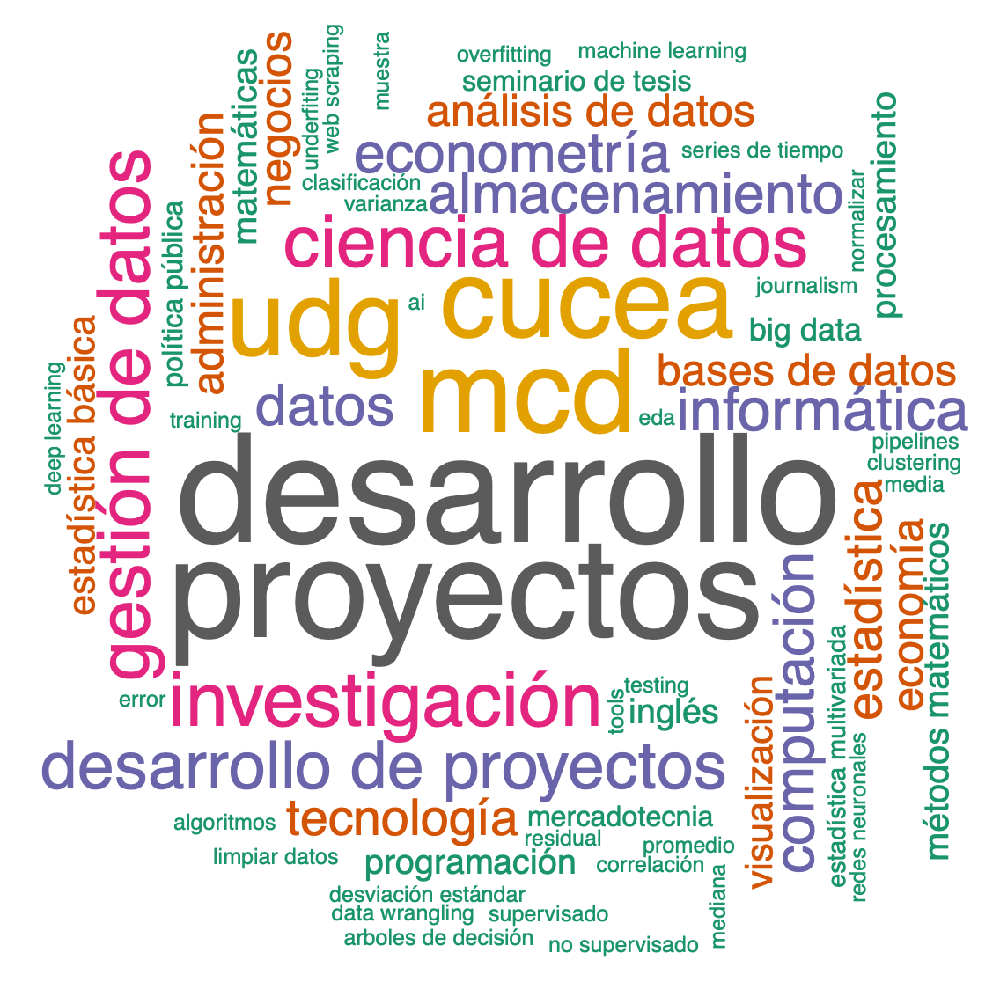

# Project Development II
_Material for the course Desarrollo de Proyectos II (Project Development II) of the Master of Data Science at Universidad de Guadalajara._  
_⚠️ Note: the material of this repository would be shared mainly in Spanish._

En este repositorio se compartirá material para los alumnos del curso _Desarrollo de proyectos II_ de la _Maestría en Ciencia de los Datos (MCD)_ de la Universidad de Guadalajara (UDG). Además, este repositorio servirá a los alumnos para aprender a utilizar GitHub y Git como una herramienta de almacenamiento, administración de control de versiones y trabajo colaborativo.

## Detalles de la materia

### Curso

|Nombre | Desarrollo de Proyectos II |
|:----:|:----:|
|NRC |182400 | 
|Clave |IH602 | 
|Ciclo escolar |2022-B (sem. otoño) | 
|Horario |Miércoles de 18 a 21 hr. | 
|Fechas |Agosto a diciembre 2022 | 
|Medio |Virtual | 
|Liga clase|[Click aquí para unirse a clase por Zoom](https://udg-mx.zoom.us/j/82510744015) |

### Profesor

Cualquier duda, aclaración o comentario sobre el material de este repositorio pueden contactarme a través de los siguientes canales:

|Nombre |e-mail |GitHub user| Página web |
|:----:|:----:|:-----:|:-----:|
|Victor Cuspinera | vcuspinera@gmail.com | [vcuspinera](https://github.com/vcuspinera) |  |

### Alumnos
Lista de alumnos del ciclo escolar 2022-B (semestre de otoño).

|Id. UDG |Nombre |e-mail UDG |e-mail alternativo |GitHub user| 
|:----:|:----:|:----:|:-----:|:-----:|
|213388296 |Carol Castañeda | [carol.castaneda3882](carol.castaneda3882@alumnos.udg.mx) | | |
|221310808 |Jorge Gomez |[jorge.gomez1080](jorge.gomez1080@alumnos.udg.mx) | | |
|220981326 |Rosa Guadalupe Guerrero|[rosa.guerrero8132](rosa.guerrero8132@alumnos.udg.mx) | | |
|221310778 |Ricardo Gutiérrez |[ricardo.gutierrez1077](ricardo.gutierrez1077@alumnos.udg.mx) | | |
|221310727 |Esther Moreno|[esther.moreno1072](esther.moreno1072@alumnos.udg.mx) | | |
|221310786 |Patricio Orozco |[juan.orozco1078](juan.orozco1078@alumnos.udg.mx) | | |
|211680429 |Cristian Omar Ruiz |[cristian.ruiz8042](cristian.ruiz8042@alumnos.udg.mx) | | |
|221310743 |Eduardo Sánchez|[eduardo.sanchez1074](eduardo.sanchez1074@alumnos.udg.mx) | | |

## Evaluación
Para la evaluación existen dos componentes, para más detalles sobre la evaluación [dar click aquí](https://github.com/vcuspinera/UDG_MCD_Project_Dev_II/tree/main/grades)

### ✏️ Evaluación general
|Descripción| Porcentaje|
|:---|:---:|
|1) Presentaciones 
*Exposición de alumnos sobre el material del libro*| 20%|
|2) Tests de lecturas| 30%|
|3) Actividades| 20%|
|4) Proyecto de análisis EDA| 10%|
|5) Proyecto final| 20%|
|**Total**| **100%**|

### ⭐️ Puntos extras
|Descripción| Porcentaje|
|:---|:---:|
|A) Proyecto personal de ciencia de datos.  
*Desarrollo del proyecto y divulgación en GitHub, LinkedIn, redes sociales u otro canal.*| 5%|
|B) Publicación   
*Publicación de 'Papers' o de artículos en revistas de ciencia de datos como Towards Data Science, divulgación de la ciencia, etc.*|5%|
|C) Voluntariado   
*Participación comprobable como voluntario en Omdena, ONU, Data Science for Social Good, entre otros.*|5%|
|D) Eventos   
*Participación comprobable en eventos relacionados con Ciencia de Datos como 'Hackathon', congresos y conferencias.*|5%|

⚠️ Nota: Se pueden participar más de una vez en cualquiera de los rubros de puntos extra, con un mácimo acumulado de 20% adicional sobre la evaluación general. Para tener acceso a los puntos extras necesitas una calificación mayor o igual a 75% en la Evaluación General.  

## Material del curso

__Canales principales__
- [Repositorio de GitHub](https://github.com/vcuspinera/UDG_MCD_Project_Dev_II)
- [Canal de comunicación Slack](https://join.slack.com/t/udgmcddesarro-gtp5577/shared_invite/zt-1e860l5on-GbDbdNKRubeUDy~7HSP1Kw)

__Material base__
- [Contenido de la materia](https://github.com/vcuspinera/UDG_MCD_Project_Dev_II/blob/main/Contenido_materia_%20IH602.pdf)
- [Clases](https://github.com/vcuspinera/UDG_MCD_Project_Dev_II/tree/main/clases)
- [Libro de Administración de Riesgos](https://github.com/vcuspinera/UDG_MCD_Project_Dev_II/tree/main/clases/material/Libro_PMI-RMP)
- [Tests de lectura](https://github.com/vcuspinera/UDG_MCD_Project_Dev_II/blob/main/docs/Quizes.md)
- [Calificaciones](https://github.com/vcuspinera/UDG_MCD_Project_Dev_II/tree/main/grades)
- [Videos de clase](https://www.dropbox.com/sh/8vy3gby1wdiqsef/AADzSXfCOX06LRFjS7IWTfK5a?dl=0)

__Material adicional__
- [Papers](https://github.com/vcuspinera/UDG_MCD_Project_Dev_II/tree/main/clases/material/Papers)
- [Guía sobre puntos extras](https://github.com/vcuspinera/UDG_MCD_Project_Dev_II/blob/main/Puntos_extras.md)

Para mayor detalle reviar el documento de [`Referencias.md`](https://github.com/vcuspinera/UDG_MCD_Project_Dev_II/blob/main/Referencias.md)

## Organización de carpetas
    ├── actividades             <- Carpeta con actividades del curso.
    │   ├── presentaciones      <- Carpeta para subir presentaciones del curso.
    │   ├── eda_analysis        <- Carpeta para proyecto con análisis exploratiorio.
    │   └── final_eval          <- Carpeta para proyecto final de la materia.
    │
    ├── clases                  <- Carpeta con material para el curso
    │   ├── data                <- Descripción de carpeta.
    │   ├── img                 <- Carpeta con imágenes para el material compartido.  
    │   ├── keys                <- Carpeta con detalle para obtener llaves de Twitter API
    │   ├── src                 <- Carpeta con programas y código.
    │   ├── material            <- Carpeta con material para el curso.
    │       ├── Libro_PMI-RMP   <- Carpeta del libro de Riesgo de *Project Managment*.
    │       └── Papers          <- Carpeta con papers a revisar en clases.
    │
    ├── grades                  <- Carpeta con calificaciones del curso.
    │
    ├── README.md               <- Archivo principal README con presentación del proyecto
    ├── LICENSE                 <- Archivo con licencia del material del repositorio.
    └── Referencias.md          <- Archivo con bibliografía y referencias del curso.
