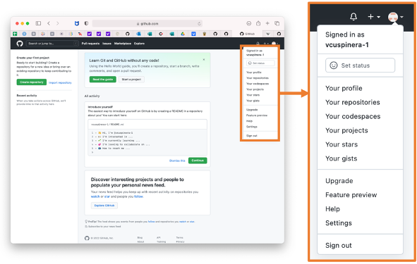
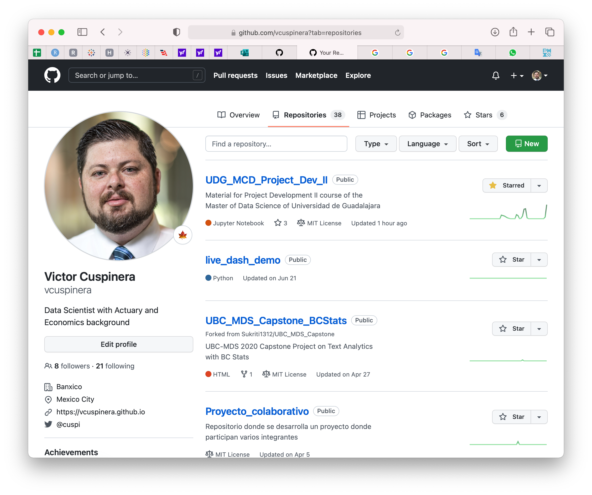
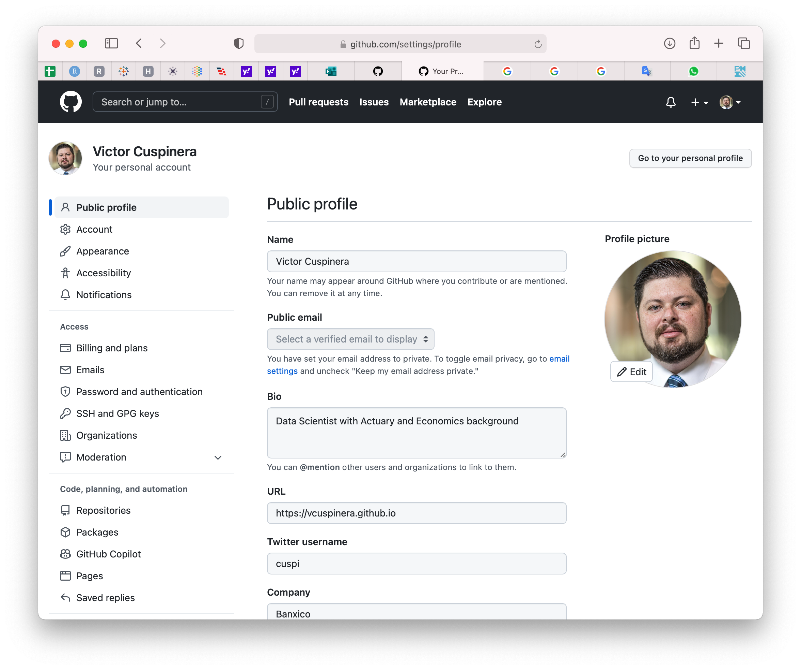

# 03 • Primer encuentro con GitHub

En [GitHub](https://github.com/), las principales opciones que utilizaremos se encuentran en la esquina superior derecha: 

Entre las opciones de este menú destacan:

|Comentario |Imagen |
|:---|:---|
|_Your profile_ es la página principal y la vista de como otros usuarios verán la actividad y proyectos que han desarrollado o en las que han participado | |
|En _Your repositories_ verán todos los repositorios que utilizaremos para desarrollar nuestros proyectos | |
|En _Settings_ se puede personalizar el perfil y la configuración de la cuenta | |
