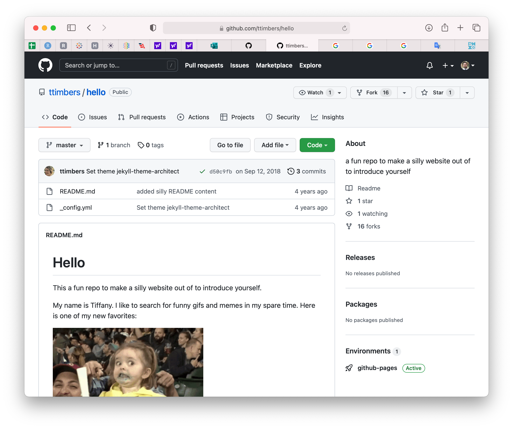
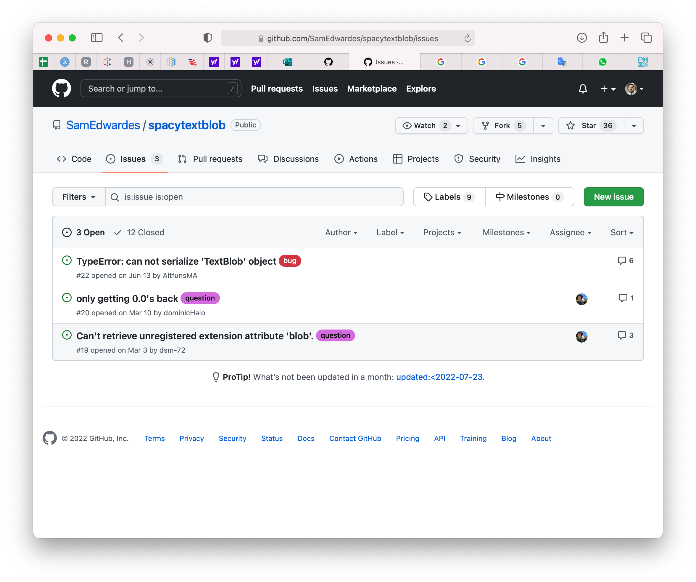
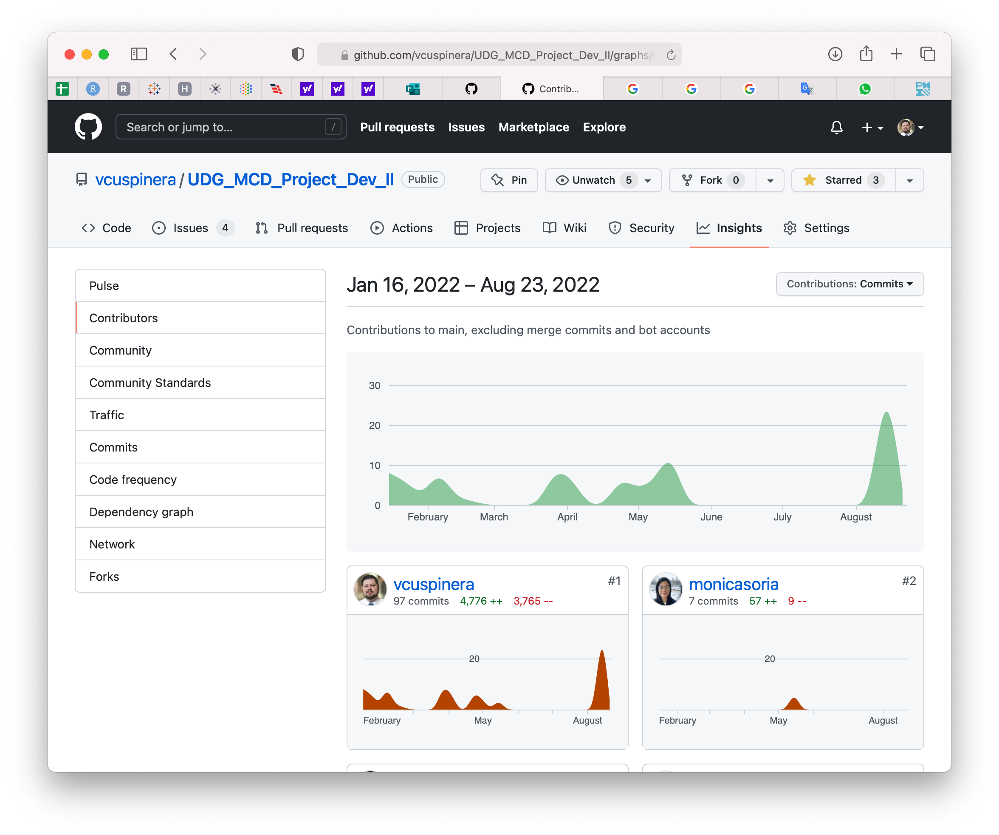
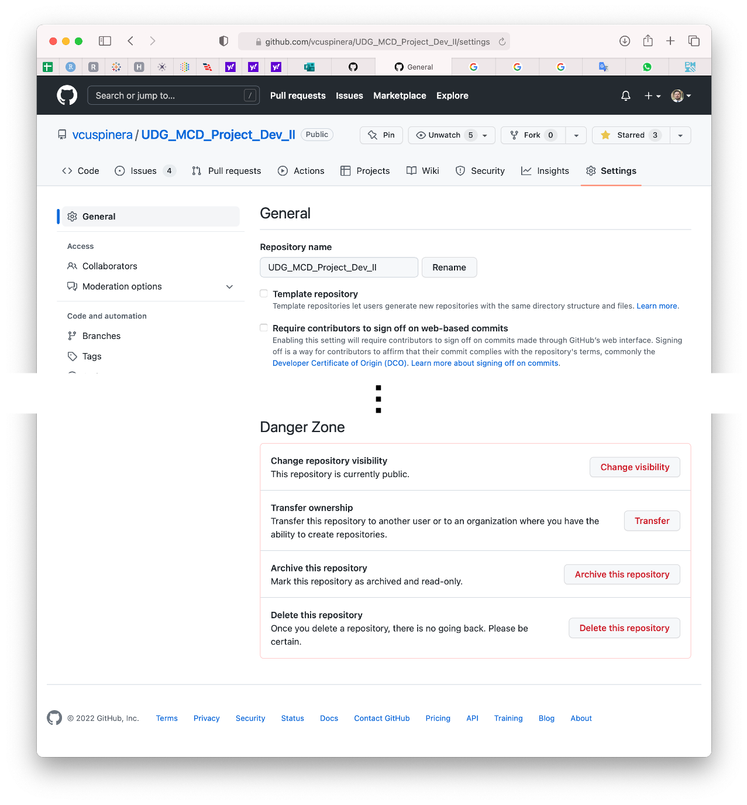

# 03 • Primer encuentro con GitHub

En [GitHub](https://github.com/), las principales opciones que utilizaremos se encuentran en la esquina superior derecha: 

Entre las opciones del menú general destacan:

|Opción |Imagen |
|:---|:---:|
|_Your profile_ es la página principal y la vista de como otros usuarios verán la actividad y proyectos que han desarrollado o en las que han participado |  [_Profile de hadley en GitHub_](https://github.com/hadley)|
|En _Your repositories_ se muestran los repositorios en los que el usuario ha desarrollado proyectos |  [_Repositorios con proyectos de vcuspinera_](https://github.com/vcuspinera?tab=repositories)|
|En _Settings_ se puede personalizar el perfil y la configuración de la cuenta |  [_Settings de cuenta GitHub de vcuspinera_](https://github.com/vcuspinera?tab=repositories)|

Por otro lado, dentro de un repositorio usaremos diversas opciones y realizaremos las acciones, específicamente las siguientes:

|Opción o acción |Imagen |
|:---|:---:|
|Ejemplo de un _repositorio_ con nombre `hello`|  [_Repositorio de ttimbers/hello_](https://github.com/ttimbers/hello)|
|Los _Issues_ nos sirven para dar seguimiento a cambios del repositorio, reportar errores, señalar documentación, reportar avances, entre otros |  [_Issues de repo SamEdwardes/spacytextblob_](https://github.com/SamEdwardes/spacytextblob/issues)|
|La opción de _Contributors_ se encuentra en _Insights_ y sirve para ver las contribuciones de los colaboradores del repositorio |  [_Contribuciones en repo del curso_](https://github.com/vcuspinera/UDG_MCD_Project_Dev_II/graphs/contributors)|
|En _Settings_ dentro de la opción _General_ se pueden cambiar el nombre del repositorio, configurar opciones, y borrar el repositorio entre otras acciones |  [_Opciones del en repo del curso_](https://github.com/vcuspinera/UDG_MCD_Project_Dev_II/settings)|
