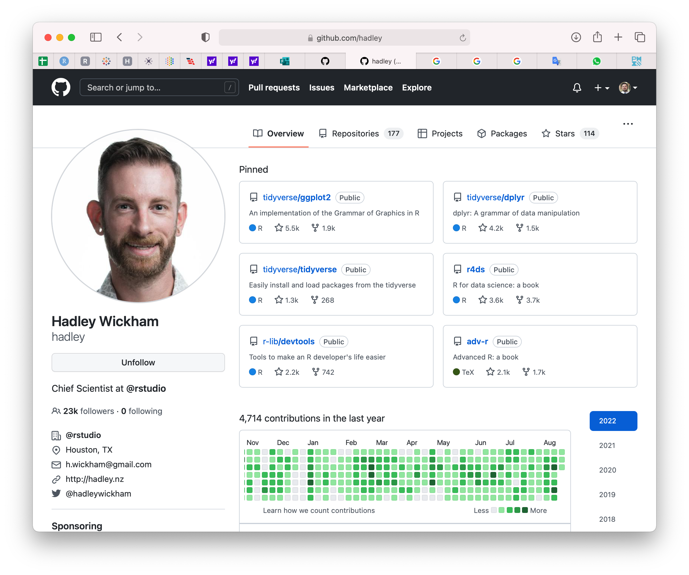

# 03 • Primer encuentro con GitHub

En [GitHub](https://github.com/), las principales opciones que utilizaremos se encuentran en la esquina superior derecha: 

Entre las opciones del menú general destacan:

|Opción |Imagen |
|:---|:---|
|_Your profile_ es la página principal y la vista de como otros usuarios verán la actividad y proyectos que han desarrollado o en las que han participado | |
|En _Your repositories_ se muestran los repositorios en los que el usuario ha desarrollado proyectos | |
|En _Settings_ se puede personalizar el perfil y la configuración de la cuenta | |

Por otro lado, dentro de un repositorio usaremos diversas opciones y utilizaremos algunas acciones, específicamente las siguientes:

|Opción o acción |Imagen |
|:---|:---|
|Ejemplo de un _repositorio_ con nombre `hello`| |
|Los _Issues_ nos sirven para dar seguimiento a cambios del repositorio, reportar errores, señalar documentación, reportar avances, entre otros | |
|La opción de _Contributors_ se encuentra en _Insights_ y sirve para ver las contribuciones de los colaboradores del repositorio | |
|En _Settings_ dentro de la opción _General_ se pueden cambiar el nombre del repositorio, configurar opciones, y borrar el repositorio entre otras acciones | |
