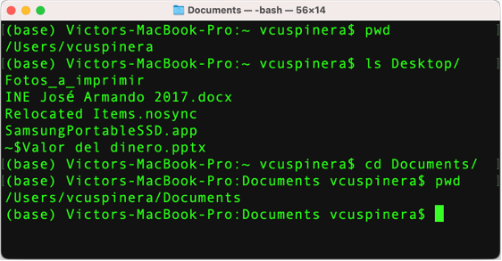
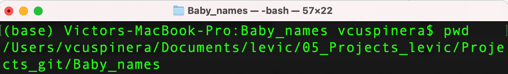
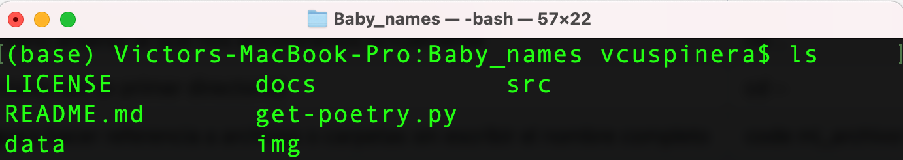

# 03 • Interfaz de usuario
*PowerShell en Windows / Terminal en Mac / Bash shell en Linux*

La Interfaz de usuario es una herramienta que nos sirve para conectarnos directamente con el sistema operativo. En este documento, usaremos la Terminal de Mac para ejemplificar la forma de navegar y manipular carpetas y archivos con algunos comandos básicos y funcionales.

## Contenido
1. Comandos básicos
2. Otros comandos utilizados
3. Símbolos
4. Ruta relativa vs absoluta
5. Referencias

## 1. Comandos básicos
Los comandos básicos para navegar archivos en el sistema usando la interfaz de usuario:

|Comando| Propósito| Ejemplo de uso|
|:---:|:---|:---|
|**pwd**| sirve para identificar el directorio de trabajo actual| pwd|
|**ls**|muestra el contenido del directorio | ls Desktop|
|**cd**|comando para cambiar directorio | cd Documents|

## 2. Otros comandos utilizados

Los siguientes comandos son los que más utilizo para navegar y manipular archivos y carpetas en el sistema usando la interfaz de usuario:

|Comando| Propósito| Ejemplo de uso|
|:---:|:---|:---|
|**clear**| borrar pantalla| clear|
|**mkdir**| crear un nuevo directorio| mkdir Nueva_carpeta|
|**rmdir**| borrar un directorio| mkdir Nueva_carpeta|
|**touch**| crear un nuevo archivo| touch nuevo_archivo.txt|
|**rm**| borrar un archivo| rm nuevo_archivo.txt|
|**mv**| renombra unn directorio o archivo | mv carpeta_antes carpeta_ahora|
|**code**| abrir un archivo usando Visual Studio Code| code mi_archivo.txt|
|**atom**| abrir un archivo usando Atom| atom mi_archivo.txt|
|**man** **-help**| Comando de ayuda, es distinto dependiendo de la interfaz usada en el sistema operativo|man cd|

## 3. Símbolos
Además, existen algunos accesos directos y símbolos muy útiles:

|Símbolo| Propósito| Ejemplo de uso|
|:---:|:---|:---|
|**.**| Hace referencia al directorio actual| ls .|
|**..**| Hace referencia al directorio anterior al que nos encontramos actualmente| cd ..|
|**~**| Hace referencia al directorio raíz (o primer directorio)| cd ~|
|*****| Se usa como comodín para hacer referencia a archivos o carpetas sin escribir el nombre completo| code mi_archivo*|

## 4. Ruta relativa vs absoluta
La ruta relativa se va seleccionando de acuerdo al directorio en el que te encuentres en la terminal, mientras que la absoluta te ayuda a llegar a una ruta específica sin necesidad de navegar a la carpeta deseada usando la interfaz de usuario.

Por ejemplo, supongamos que actualmente estoy en este directorio:

 
 
Y dentro de este directorio tengo las siguientes carpetas:

Si quiero seleccionar la carpeta “Tareas”, puedo hacerlo de las dos siguientes maneras:

`cd /Users/vcuspinera/Documents/levic/05_Projects_levic/Projects_git/Baby_names/docs`

ó

`cd docs`

 

**¿Ventajas de usar ruta absoluta para seleccionar carpetas?**  
Las rutas absolutas son fáciles de enetender y te comparten más información, pero pueden causar inconvenientes ya que es necesario incluir la dirección desde el directorio raíz lo que varía entre usuarios y hace que al momento de programar el código sea más largo.

**¿Ventajas de usar ruta relativa para seleccionar carpetas?**  
Aunque la ruta relativa contiene menos información que la ruta absoluta, es más fácil y dinámica para usar, se adapta mejor a las necesidades de un usuario para replicar un proyecto y la dirección es más corta lo que la hace más conveniente principalmente en directorios muy profundos.

## 5. Referencias
- Material público del curso [Plataformas para ciencia de datos](https://github.com/UBC-MDS/DSCI_521_platforms-dsci) de UBC MDS.
- [Navegación de archivos y directorios](https://swcarpentry.github.io/shell-novice/02-filedir/index.html) en Unix Shell.
- [Absolute vs. relative path](https://www.educative.io/answers/absolute-vs-relative-path), by Anusheh Z. Mustafeez.
