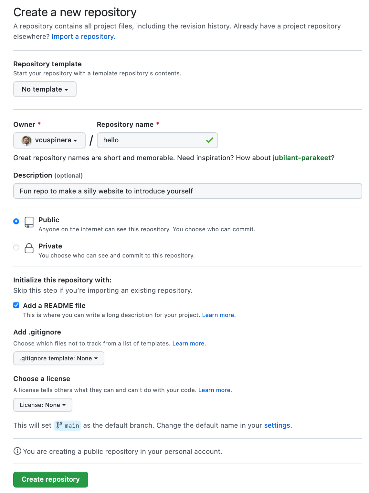
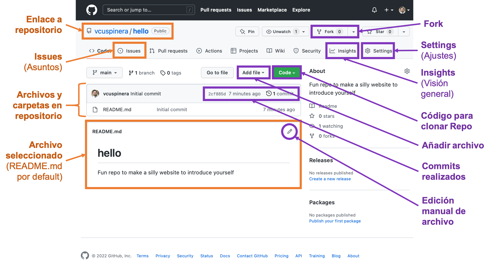
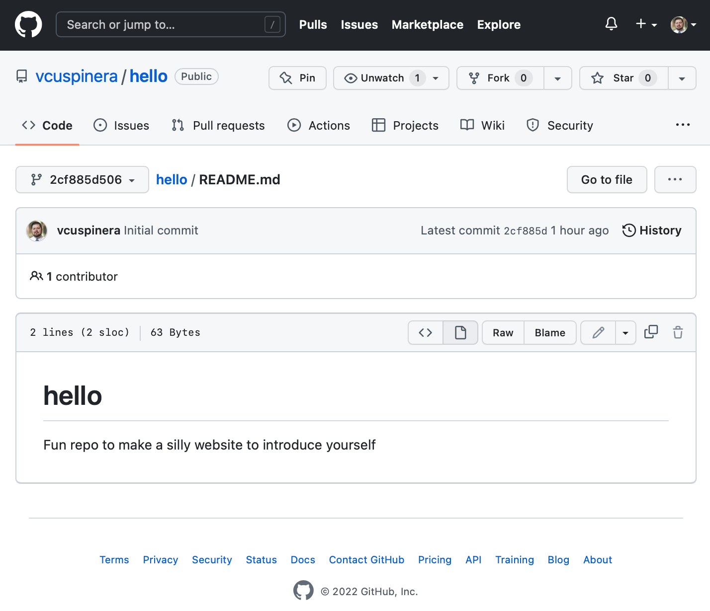
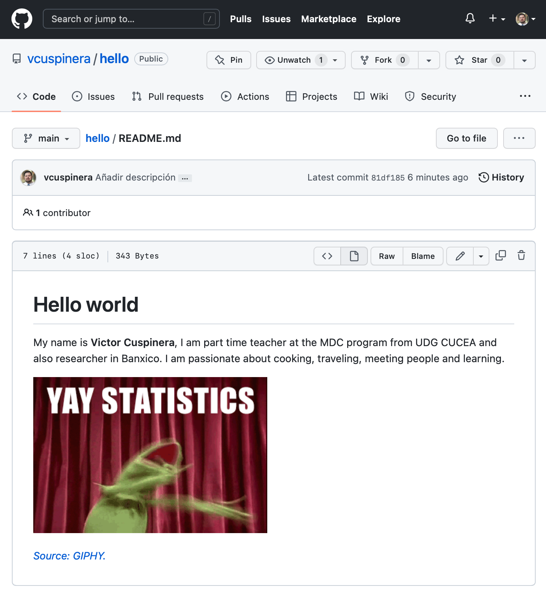
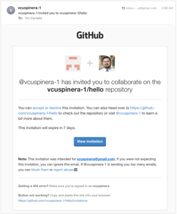
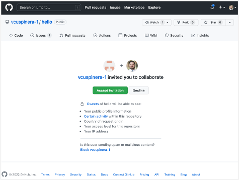
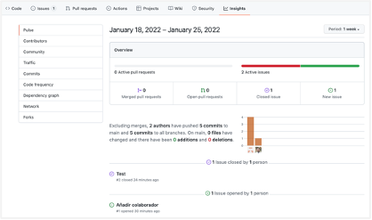
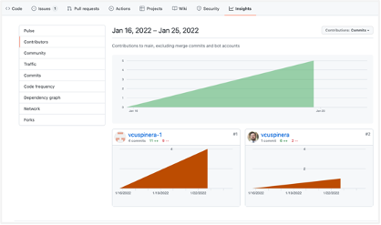

# 06 • Práctica con GitHub
*Práctica usando GitHub para crear su primer repositorio*

Git es una herramienta utilizada para trabajar de forma local (en equipo propio) el sistema de control de versiones, y GitHub de forma remota (web). En esta sección trabajaremos con el control de versiones usando GitHub de forma remota para crear su primer repositorio desde cero para después personalizarlo.

## Contenido
1. Crear su primer repositorio
2. Secciones del nuevo repositorio
3. Edición manualmente de un archivo
4. Crear y administrar un *Issue*
5. Añadir un colaborador a repositorio
6. Revisión de aportaciones de colaboradores
7. Referencias

## 1. Crear su primer repositorio
Para crear un repositorio se debe:
- ir a opciones en la esquina superior derecha,
- seleccionar `Your repositories`, y 
- dar click en el botón que dice `New`.

En este caso, las opciones del repositorio serán las siguientes:

- En `Repository name`, escribir: **hello**
- En el campo `Description` añadir una descripción del repositorio.
- Seleccionar la opción: **Public**
- Seleccionar la opción: **Add README file**
- Dar click en `Create repository`

<center></center>

## 2. Secciones del nuevo repositorio

El nuevo repositorio tiene una vista similar a la siguiente, donde se han marcado algunas de las opciones más comunes a utilizar:

<center></center>

## 3. Edición manualmente de un archivo
Lo primero que haremos es modificar manualmente el archivo README.md dando click sobre el lápiz de edición ✏️

Realizar las siguientes modificaciones:
1. En el cuadro de `Edit file`, cambiar el título de **# hello** a **# Hello world**.
2. En ese mismo cuadro (`Edit file`) borrar la descripción, añadir un renglón y posteriormente realizar una descripción de ustedes mismos en un párrafo (uno o dos renglones).
3. Entrar a la página de [GIPHY](https://giphy.com)  
   3.1. seleccionar un tema en el buscador  
   3.2. identificar un GIF que les guste  
   3.3. dar click sobre el GIF  
   3.4. dar click sobre **Share**  
   3.5. dar click sobre **Copy GIF Link**  
4. Después regresar a su página de GitHub, para pegar el link de la imagen y añadir la fuente. ([ver actividad `05_Markdown_basics.md`](https://github.com/vcuspinera/UDG_MCD_Project_Dev_II/blob/main/actividades/05_Markdown_basics.md)). *Hint: copiar y pegar el texto del siguiente cuadro, y cambiar el texto “pegar_link_aquí” por el link del GIF (paso 3.5).*

```


*[Source: GIPHY](pegar_link_aquí)*
```
5. Finalmente, hasta abajo en la sección `Commit changes` en el primer cuadro poner:  
   5.1. el título del commit **“Añadir descripción”**,  
   5.2. en su descripción **“Se añadió una descripción personal y un GIF”**,  
   5.3. dejar seleccionado la opción `Commit directly to the main branch`, y  
   5.4. dar click en `Commit changes`.

Así es como cambia visualmente de la versión inicial a la versión editada del archivo:

|Versión inicial | Versión final|
|:---:|:---:|
|||

## 4. Crear y administrar un *Issue*
Los *Issues* nos sirven para tener un control sobre el proyecto en el repositorio, asignar tareas, dar seguimiento a pendientes, escribir el *status* del proyecto, compartir minutas, documentos y materiales.

Para generar un __nuevo *Issue*__ deben seguir los siguientes pasos:
1. seleccionar la opción `Issues`, y
2. dar click en el botón `New issue`.
3. en este caso en titulo escribir **“Test”** y en la descripción (write) escribir **“Este es un test para revisar el funcionamiento de los issues.”**,
4. posteriormente dar click en `Submit new issue`.

Para __cerrar un *Issue*__ hagan lo siguiente:
1. ir a la opción `Issues`,
2. dar click en issue de su interes, en este caso seleccionar el que creamos en el párrafo anterior de nombre **“Test”**,
3. hasta abajo escribir un comentario como **“Se terminó de realizar la prueba con éxito por lo que se cierra el asunto.”**, y
4. dar click en la opción `Close with comment`. 
*Nota: Al dar click nuevamente en `Issues` el asunto “Test” aparecerá como un issue cerrado.*

**⭐️ Actividad para todos:**  
Generar un *nuevo issue* con las siguientes características: 
- Título: **“Añadir colaborador”**
- Descripción: **“Añadir como colaborador de este repositorio a mi compañero de equipo”**

## 5. Añadir un colaborador a repositorio
Para añadir a un colaborador a este repositorio habrá que hacer los siguiente:
1. seleccionar `Settings`,
2. seleccionar la opción `Collaborators`,
3. dar click en el botón `add people`,
4. escribir el nombre de usuario de GitHub de su compañero de equipo, (en caso que no asista su compañero de equipo, añadir mi usuario **vcuspinera**)
5. después dar click en `Add *nombre_de_usuario* to this repository`,

Su compañero de equipo recibirá un correo como el siguiente donde deberá aceptar la invitación desde su cuenta de GitHub.

|Correo recibido|Aceptación de invitación|
|:---:|:---:|
|||


**⭐️ Actividad para todos:**  
El compañero que fue invitado al repositorio deberá editar el `README.md` file del compañero añadiendo un texto donde comenten que son colaboradores de equipo, con una muy breve descripción de ustedes.

## 6. Revisión de aportaciones de colaboradores
Para revisar las aportaciones de los colaboradores ir a la pestaña de `Insights`, y en las opciones de `Pulse` y `Contributors` podrán ver a grandes rasgos el volumen de contribución de ustedes y su(s) compañero(s) de equipo.
*Nota: Es importante que su compañero haya realizado la modificación descrita al final de la sección anterior para que se refleje en estas dos secciones.*

|Opción `Pulse`|Opción `Contributors`|
|:---:|:---:|
|||

## 7. Referencias
- Idea original en repositorio [`ttimbers/hello`](https://github.com/ttimbers/hello) en GitHub por Tiffany Timbers.
- Material público del curso [Plataformas para ciencia de datos](https://github.com/UBC-MDS/DSCI_521_platforms-dsci) de UBC MDS.
- Capítulo [Introduce yourself to Git](https://happygitwithr.com/hello-git.html) de "Happy Git and GitHub for the useR" por Jenny Bryan.