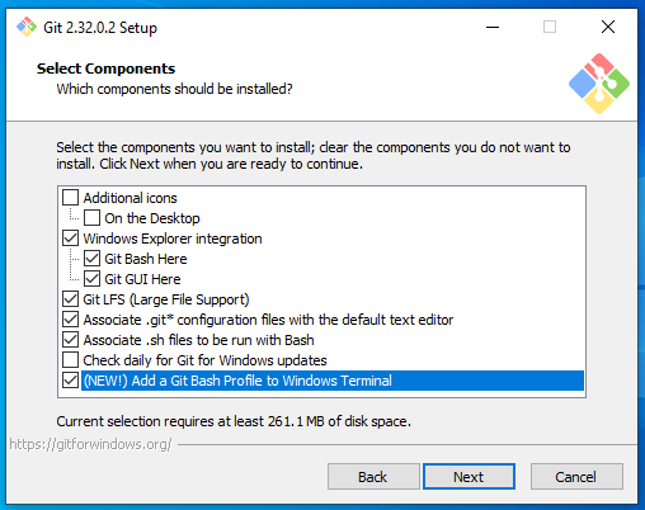
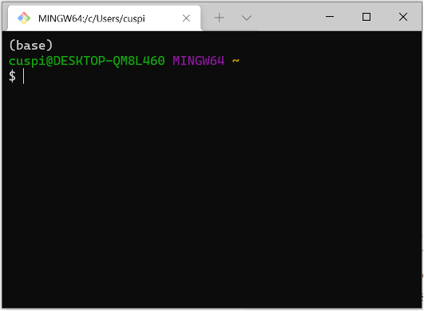

# 07 • Git local
*Guía básica para instalar y configurar el sistema Git de controlador de versiones en nuestro equipo local*

Git es una herramienta utilizada para trabajar de forma local (en equipo propio) el sistema de control de versiones, y GitHub de forma remota (web). En esta sección veremos como instalar Git desde distintos sistemas operativos, y realizar la configuración de usuario.

## Contenido
1. Instalación de Git
  1.1 Ya lo tengo instalado?
  1.2 Instalación en macOS
  1.3 Instalación en Windows
    1.3.1 …de Git
    1.3.2 …de la Terminal de Windows
  1.4 Instalación en Linux
2. Configuración de la información de usuario de Git
3. Referencias

## 1. Instalación de Git
### 1.1 Ya lo tengo instalado?
Para revisar si ya tenemos Git instalado en nuestro equipo hay que correr desde la interfaz de usuario (Terminal / PowerShell / Bash) el siguiente código y revisar su resultado:

```
which git
git --version
```

Si estos comandos regresan la ubicación y el número de versión de Git, entonces pasar directo a capítulo 2. Sin embargo, si este código regresar `git: command not found` habrá que hacer la instalación de Git en el sistema operativo que les corresponde.

### 1.2 Instalación en macOS
Correr el siguiente código, y dar click en “Install”:

```
git –version
```

Una alternativa es instalar Xcode:
```
xcode-select --install
```

Otra alternativa es instalarlo directamente desde la siguiente página http://git-scm.com/download/mac


### 1.3 Instalación en Windows
#### 1.3.1 …de Git
Ir a la página https://git-scm.com/download/win y descargar la versión de Git para Windows, correr el archivo ejecutable, y aceptar la configuración de default de todas las secciones excepto al siguiente:

- En la página **Select Components**, añadir Git Bash profile a la terminal de Windows:



[Fuente original](https://ubc-mds.github.io/resources_pages/install_ds_stack_windows/#git-bash-and-windows-terminal) en la guía para instalación de software del programa UBC MDS.

- En la página **Choosing the default editor used by Git**, seleccionar la opción “Use Visual Studio Code as Git’s default editor”.

#### 1.3.2 …de la Terminal de Windows
Windows Terminal es una alternativa que se recomienda usar en el lugar de trabajar directamente con PowerShell de Windows.

Para instalar la terminal de Windows [dar click en este link](https://www.microsoft.com/p/windows-terminal/9n0dx20hk701), dar click en “Obtener” para abrirlo en Windows Store. Volver a dar click en “Obtener” y después en “Instalar”.

Después de la instalación, abrir la Windows Terminal, y dar click sobre la flechita que está en la parte superior derecha (alternativa es usar el shortcut `Ctrl + ,`). En la sección “Inicio”, en “Perfil predeterminado” seleccionar la opción de “Git Bash”.

Una vez realizado lo anterior, cerrar la Terminal y volverla a abrir, y deberá de verse similar a la siguiente pantalla. Se recomienda usar de ahora en adelante la Terminal en el lugar de PowerShell.



### 1.4 Instalación en Linux
En Linux se utiliza el siguiente código para Ubuntu o Debian:

```
sudo apt-get install git
```

O el siguiente código para Fedora o RedHat:

```
sudo yum install git
```

O en la siguiente liga existen otras alternativas de instalación en Linux: https://git-scm.com/download/linux 

## 2. Configuración de la información de usuario de Git
Para la configuración de Git debemos dar nuestro nombre y correo electrónico desde la interfaz de usuario, usando el siguiente código (favor de reemplazar el texto `nombre apellido` y `correo@example.com` con nuestros datos, los cuales deben coincidir con los usados cuando en nuestra cuenta de GitHub).

```
git config --global user.name "nombre apellido"
git config --global user.email correo@example.com
```

Podemos revisar la información que dimos usando el siguiente comando desde la interfaz de usuario `git config --list --global` y podemos editar esta información con el siguiente comando `code ~/.gitconfig`


## 3. Referencias
- [Guía para instalación de software](https://ubc-mds.github.io/resources_pages/installation_instructions/) del programa UBC MDS.
- Material público del curso [Plataformas para ciencia de datos](https://github.com/UBC-MDS/DSCI_521_platforms-dsci) de UBC MDS.
- Capítulos [Install Git](https://happygitwithr.com/install-git.html) e [Introduce yourself to Git](https://happygitwithr.com/hello-git.html) de "Happy Git and GitHub for the useR" por Jenny Bryan.
