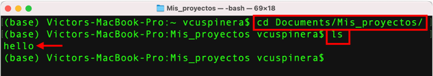

# 08 • Git & GitHub basics
*Práctica usando Git de forma local y GitHub de forma remota*

Git es una herramienta utilizada para trabajar de forma local (en equipo propio) el sistema de control de versiones, y GitHub de forma remota (web). En esta sección trabajaremos con el control de versiones usando Git de forma local y GitHub de forma remota.

## Contenido
1. `git clone`, clonar un repositorio de GitHub en tu Git local
2. Navegar en repositorio clonado
3. Modificar un archivo en repositorio local
4. Crear carpetas y archivos en repositorio local
5. Actualizar repositorio remoto de GitHub desde repositorio local Git
6. Actualizar repositorio local Git desde repositorio remoto de GitHub
7. Revisar historial del proyecto
8. Resumen de comandos de git en la terminal
9. Referencias


## 1. `git clone`, clonar un repositorio de GitHub en tu Git local

La acción de clonar sirve para descargar un repositorio de GitHub en nuestro equipo local, donde podremos correr y modificar archivos y código. Para realizar la clonación hay que seguir estos pasos:

1. ir a tu repositorio (en este caso al repositorio que cada uno creo con el nombre “hello”),
2. dar click en el botón **Code**,


3. en la sección **Code**, revisar que esté seleccionada la opción **HTTPS**, y copiar el URL (dirección electrónica),
4. en tu equipo abrir la interfaz de usuario (Terminal),
5. en la terminal navegar hasta la carpeta **Documentos**, crear una carpeta de nombre **Mis_proyectos**, y ubicarse dentro de esta carpeta:
```
cd Documentos
mkdir Mis_proyectos
cd Mis_proyectos
```
6. en la terminal clonar el archivo con código `git clone` y pegando el URL del repositorio:
```
git clone pegar_URL_de_paso_3
```


## 2. Navegar en repositorio clonado
Para revisar que su repositorio se ha clonado de forma correcta, se puede revisar desde el navegador de documentos:


También se puede revisar que se ha clonado el repositorio a través de la interfaz de usuario, navegando hasta la carpeta `cd Documents/Mis_proyectos` y revisando que se encuentre ahí una carpeta de nombre **“hello”**.




## 3. Modificar un archivo en repositorio local
Abrir archivo README.md con Visual Studio Code ubicado en la carpeta hello:
```
cd Documents/Mis_proyectos/hello
code README.md
```
*__Nota__: también se puede abrir con otro editor de textos como Atom.*

En la última línea del archivo añadir el siguiente código y guardarlo:
```
<br>
Maestría en Ciencia de Datos de Posgrados CUCEA de la Universidad de Guadalajara.

```
*__Nota__: también puede poner un texto similar en inglés si así lo prefieren.*

## 4. Crear carpetas y archivos en repositorio local
En la terminal ubicarse en el repositorio **“hello”** con `cd Documents/Mis_proyectos/hello` y crear una carpeta que se llame `docs`.
Una vez creada la carpeta `docs`, ubicarse dentro de la carpeta, crear un archivo con el nombre **Referencias.md** y abrir ese archivo con `code`.


En ese archivo copiar y pegar el siguiente texto, y posteriormente guardar el archivo.

```
# Referencias
Esta carpeta se basa en el siguiente material:
- Material público del curso [Plataformas para ciencia de datos](https://github.com/UBC-MDS/DSCI_521_platforms-dsci) de UBC MDS.  
- Repositorio [ttimbers/hello](https://github.com/ttimbers/hello) en GitHub.  
- [Happy Git and GitHub for the useR](https://happygitwithr.com/index.html) de Jenny Bryan.  
```

## 5. Actualizar repositorio remoto de GitHub desde repositorio local Git
Una vez realizados los cambios y añadido una carpeta y archivo en el repositorio local (Git) hay que subir los cambios al repositorio remoto (GitHub). El primer paso es ubicarse en la interfaz de usuario en el repositorio **“hello”**, donde con el siguiente código se puede revisar los archivos que se han modificado o se han añadido:

```
git status
```

El siguiente código sirve para añadirán TODOS los archivos y carpetas modificados y nuevos al área de `staying` 

```
git add .
``` 
*Nota: se puede añadir el nombre del archivo específico en el lugar del punto `.` que hace referencia a todos los archivos.*

Posteriormente hay que hacer `commit`, siempre escribiendo `-m` y añadiendo un comentario entre comillas, por lo que puedes usar el siguiente código como referencia:

```
git commit -m “Update my repo”
```

Para enviar los cambios al repositorio remoto (GitHub) correr el siguiente código:
```
git push
```


*Source: [Git, GitHub, & Workflow Fundamentals, by Molly Nemerever](https://dev.to/mollynem/git-github--workflow-fundamentals-5496)*

*Nota: Cada vez que se hagan cambios del repositorio en el equipo local (Git) y haya que subirlos al repositorio remoto (GitHub) se deben usar los tres comandos `git add`, `git commit` y `git push` de forma seguida:*

```
git add NOMBRE_DE_ARCHIVO
git commit -m “PONER COMENTARIO AQUÍ”
git push
```

## 6. Actualizar repositorio local Git desde repositorio remoto de GitHub
En caso de hacer cambios en el repositorio remoto y querer actualizarlos en el repositorio local, lo que hay que hacer es ubicarse en la Terminal en el repositorio “hello”, y correr el siguiente código

```
git pull
```

## 7. Revisar historial del proyecto
Como se mencionó inicialmente Git y GitHub es un sistema controlador de versiones de repositorios y documentos, y existen distintas maneras de revisar el historial de versiones en un proyecto:

1. Revisando directamente en el repositorio de GitHub, en la sección que se encuentra sobre los documentos, del lado derecho dice **“N commits”**, dar click sobre el texto y te llevará al historial de cambios del repositorio.


2. Desde la interfaz de usuario en el repositorio local (*Documents/Mis_proyectos/hello*), correr el código: `git log`.

## 8. Resumen de comandos de git en la terminal
Los comandos de git utilizados en este documento:

| Código| Descripción| Ejemplo de uso|
|---|---|---| 
|`git clone` | Sirve para descargar un repositorio de GitHub en nuestro equipo local | `git clone pegar_URL_de_GitHub_repo`|
|`git status` | Sirve para verificar el estado de archivos y carpetas modificadas | `git status`|
|`git add NOMBRE_DE_ARCHIVO`| Añade los archivos y/o carpetas mencionadas al área de staying. Si se utiliza “.” en el lugar de poner el nombre de un archivo entonces se añadirán todos los archivos y carpetas que tuvieron un cambio o son nuevos. |`git add README.md`|
|`git commit -m “COMENTARIO”` |Envía al Git los cambios añadidos previamente con git add | `git commit -m “Update README file”`|
|`git push` | Sube los archivos al repo remoto en GitHub| `git push`|
|`git pull` | Actualiza el repositorio local con base en el repositorio remoto en GitHub| `git pull`|
|`git log`| Regresa el historial de cambios del repositorio| `git log`|

## 9. Referencias
- [Guía para instalación de software](https://ubc-mds.github.io/resources_pages/installation_instructions/) del programa UBC MDS.
- Material público del curso [Plataformas para ciencia de datos](https://github.com/UBC-MDS/DSCI_521_platforms-dsci) de UBC MDS.
- [Happy Git and GitHub for the useR](https://happygitwithr.com/) por Jenny Bryan.
