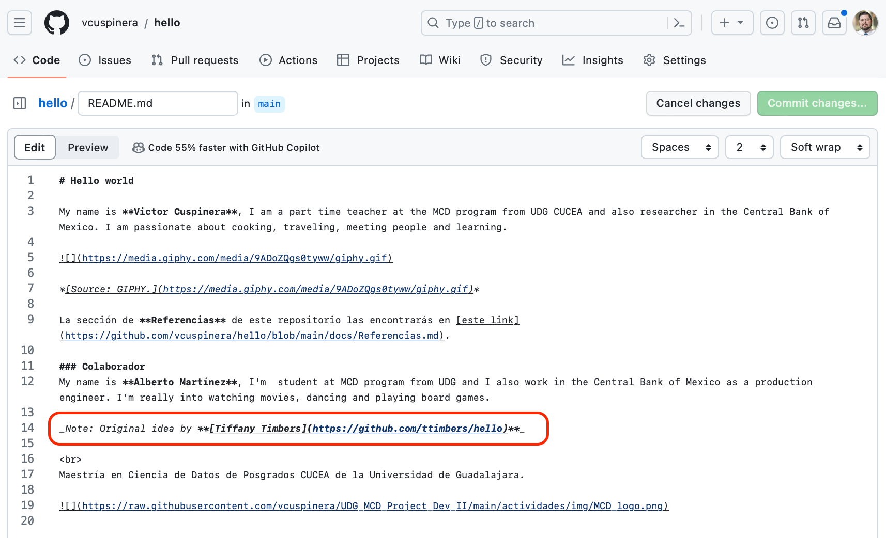
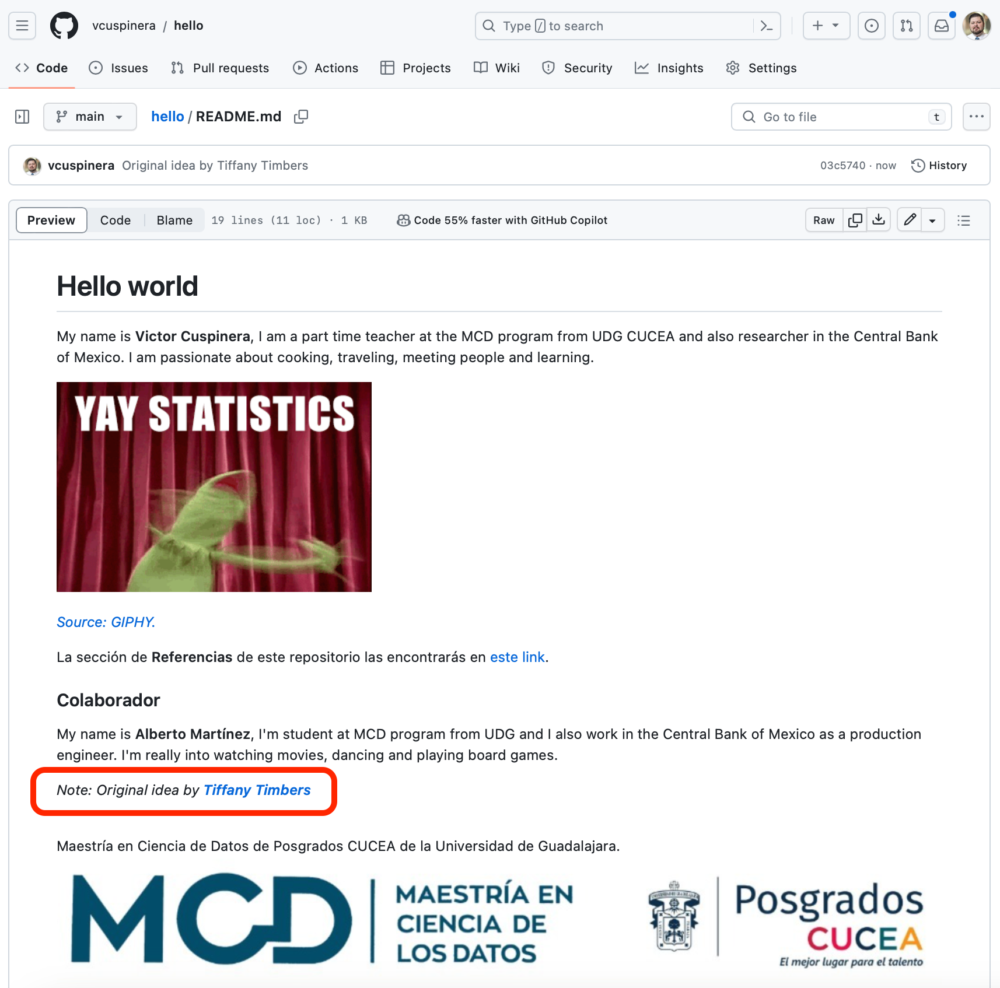
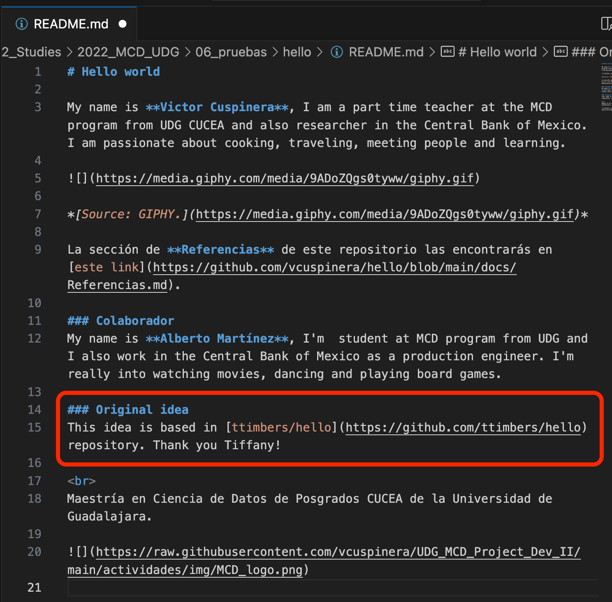
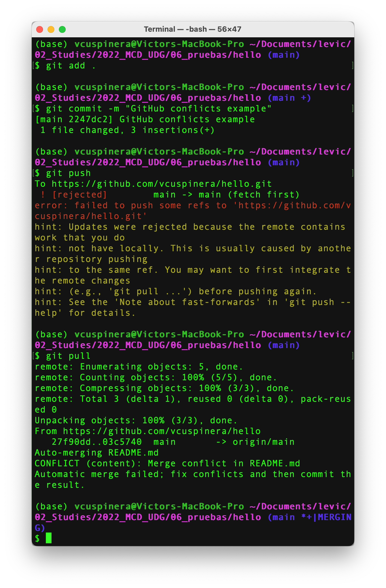
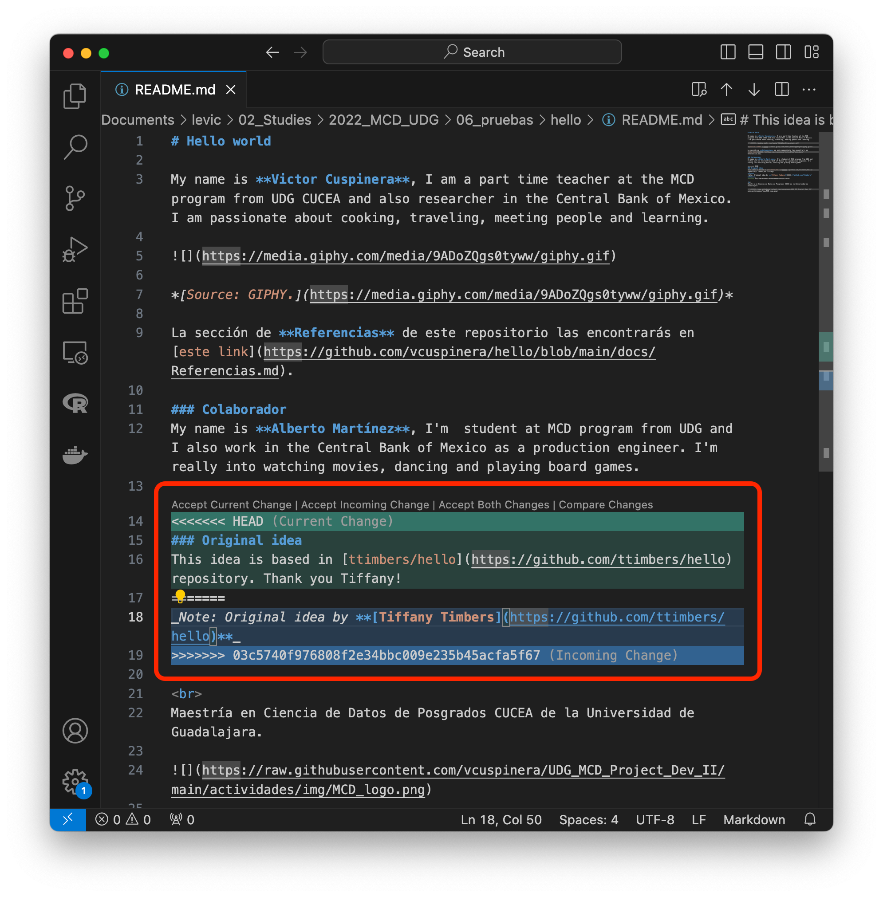
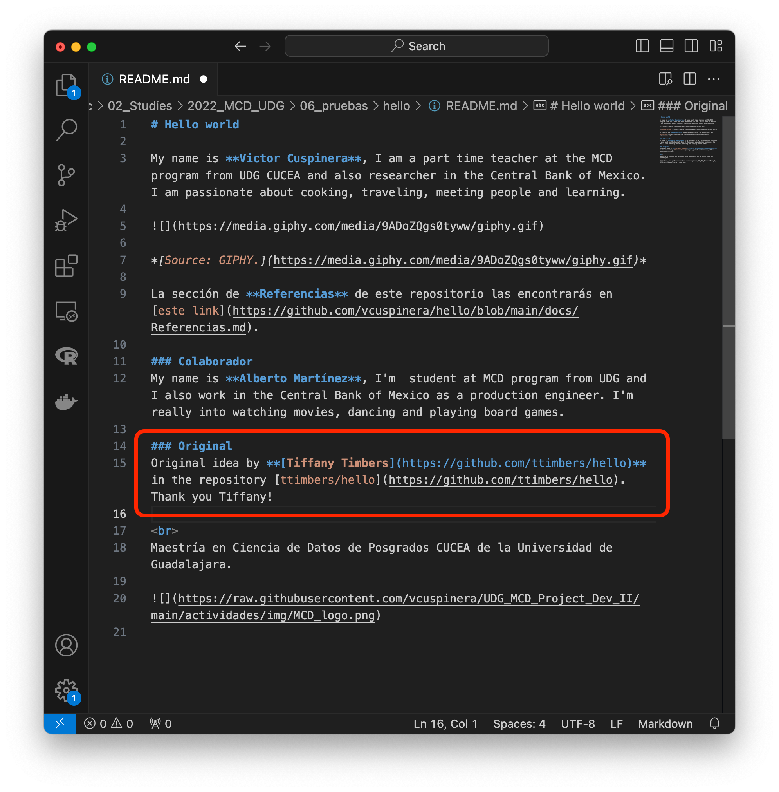
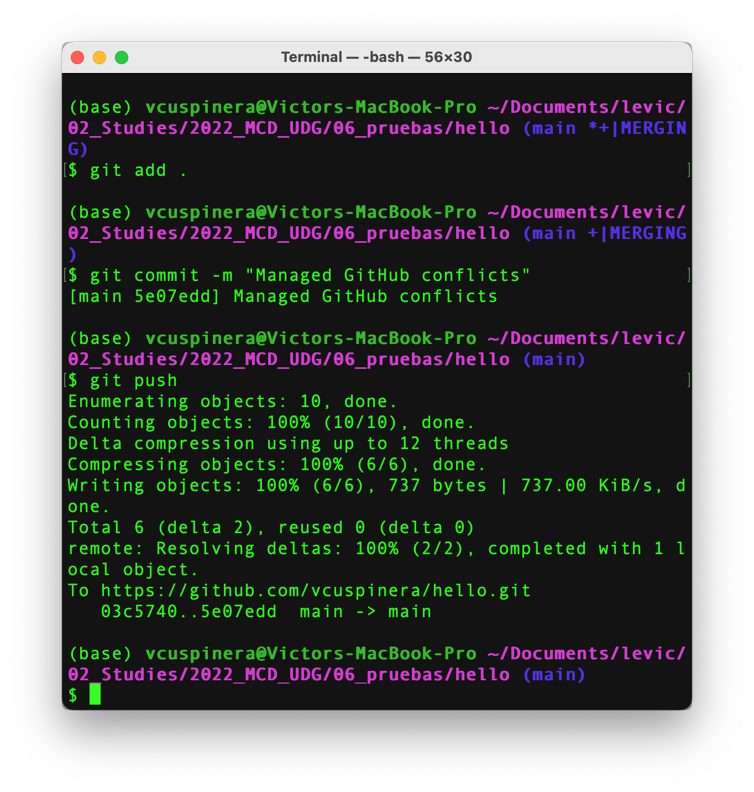
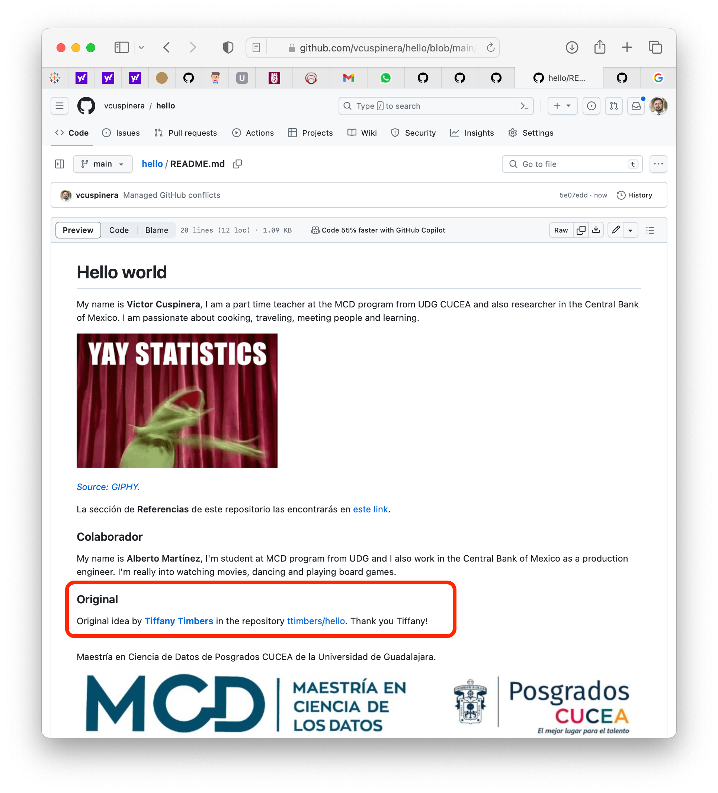

# 09 • GitHub conflicts
*Revisión de manejo de conflictos en Git y GitHub*

Git es una herramienta utilizada para trabajar de forma local (en equipo propio) el sistema de control de versiones, y GitHub de forma remota (web). En esta sección trabajaremos con el manejo de conflictos en Git y GitHub.

## Contenido
1. En general
2. Cómo identificar si hay un conflicto?
3. Corregir un conflicto
4. Actividad
5. Referencias

## 1. En general
Al usar el controlador de versiones, sobre todo al trabajar en equipo, puede suceder que se realicen cambios en mismo archivo:
1. si las modificaciones en el archivo son en líneas distintas del mismo documento, entonces Git podrá realizará los cambios sin problema; sin embargo,
2. si las modificaciones en el archivo coinciden en alguna línea, entonces Git NO podrá realizar los cambios automáticamente y se generará un conflicto.

## 2. Cómo identificar si hay un conflicto?
Cuando realizaste algún cambio en el repositorio local, y lo intentas subir al repositorio remoto corriendo el siguiente código desde la Terminal `git push` y aparece un mensaje como el que sigue:

    ```
    To https://github.com/vlad/planets.git
    ! [rejected]        master -> master (non-fast-forward)
    error: failed to push some refs to 'https://github.com/vlad/planets.git'
    hint: Updates were rejected because the tip of your current branch is behind
    hint: its remote counterpart. Merge the remote changes (e.g. 'git pull')
    hint: before pushing again.
    hint: See the 'Note about fast-forwards' in 'git push --help' for details.
    ```

Si además, al correr desde la Terminal el código `git pull` y aparece el siguiente mensaje:

    ```
    remote: Counting objects: 5, done.
    remote: Compressing objects: 100% (2/2), done.
    remote: Total 3 (delta 1), reused 3 (delta 1)
    Unpacking objects: 100% (3/3), done.
    From https://github.com/vlad/planets
    * branch            master     -> FETCH_HEAD
    Auto-merging mars.txt
    CONFLICT (content): Merge conflict in mars.txt
    Automatic merge failed; fix conflicts and then commit the result.
    ```

Entonces existe un conflicto.

## 3. Corregir un conflicto
Para corregir un conflicto habrá que seguir los siguientes pasos:
1. desde la Terminal correr el código `git pull` donde el sistema te dirá el nombre del archivo que tiene conflicto,
2. abrir el archivo que tiene conflicto usando un editor de texto como **Visual Studio Code** o **Atom**,
3. En el texto buscar el o los conflictos:

    3.1. Cada conflicto inicia con el texto "<<<<<<< HEAD", le sigue el texto original, un separador "=======", y el texto modificado, y termina con ">>>>>>>" y un código del `branch` (rama). Ejemplo:

        ```
        If you have questions, please
        <<<<<<< HEAD
        open an issue
        =======
        contact the professor by email.
        >>>>>>> badd5c8c450e1000are9b14b4383acc99f49ar1f
        ```

    3.2. Para corregir los conflictos hay que editar manualmente el texto, quitando "<<<<<<< HEAD", el separador "=======" y el cierre ">>>>>>>" con código de la rama. Ejemplo:

        ```
        If you have questions, please open an issue or 
        contact the professor by email.
        ```

4. Una vez corregido el conflicto, habrá que salvar el archivo y subir los cambios al repositorio remoto desde la terminal con `git add`, `git commit` y `git push`. **Hint:** Revisar *sección 5* de la actividad [08_Git_and_GitHub.md](https://github.com/vcuspinera/UDG_MCD_Project_Dev_I/blob/main/actividades/08_Git_and_GitHub.md) para ver cómo usar los tres comandos mencionados de `git`.

## 4. Actividad
### Cambios en repositorio remoto (GitHub)
1. Abrir el repositorio `hello` creado en la actividad [06 • Crear primer repo en GitHub](https://github.com/vcuspinera/UDG_MCD_Project_Dev_I/blob/main/actividades/06_GitHub_firstie.md).

2. Editar el README file principal del repositorio remoto (en GitHub), añadiendo un texto antes del pie de página; por ejemplo:

```
_Note: Original idea by **[Tiffany Timbers](https://github.com/ttimbers/hello)**_
```



Este cambio se refleja en el repositorio de GitHub así:



### Cambios en repositorio local (Git)
3. De forma paralela, editar el archivo README principal guardado en su repositorio local (Git), añadiendo un texto antes del pie de página, en el **mismo renglón** que la edición que se hizo en el repositorio remoto. Por ejemplo, añadiendo el siguiente texto:

```
### Original idea
This is based in [ttimbers/hello](https://github.com/ttimbers/hello) repository. Thank you Tiffany!
```



### Conflicto

4. Al intentar subir el archivo README file editado en el repositorio local (Git) usando (`git add`, `git commit` y `git push`) nos dirá que el repositorio remoto (GitHub) tiene cambios por lo que hacemos `git pull`. Al jalar la información remota nos aparecerá un conflicto:



5. Para resolver el conflicto de un markdown hay que abrir el archivo README file, donde estará marcada la diferencia entre el archivo local y el remoto. El conflicto inicia con el texto "<<<<<<< HEAD", le sigue el texto del repositorio local, un separador "=======", el texto del repositorio remoto, los siguientes signos ">>>>>>>" y termina con el código del `branch` (rama).



6. Para corregir el conflicto hay que editar manualmente el texto, quitando "<<<<<<< HEAD", el separador "=======" y el cierre ">>>>>>>" con código de la rama, y escribir lo que se quiere que quede finalmente. En nuestro ejemplo, la propuesta de edición final es la siguiente:

```
### Original
Original idea by [Tiffany Timbers](https://github.com/ttimbers) in the repository [ttimbers/hello](https://github.com/ttimbers/hello). Thank you Tiffany!
```


7. Una vez editado el conflicto, al subirlo del repositorio local al remoto, no aparecerá ningún error:



8. La vista final del archivo en el repositorio remoto es la siguiente:



## 5. Referencias
- Material público del curso [Plataformas para ciencia de datos](https://github.com/UBC-MDS/DSCI_521_platforms-dsci) de UBC MDS.
- GitHub Docs [Resolving a merge conflict using the command line](https://docs.github.com/en/pull-requests/collaborating-with-pull-requests/addressing-merge-conflicts/resolving-a-merge-conflict-using-the-command-line).
