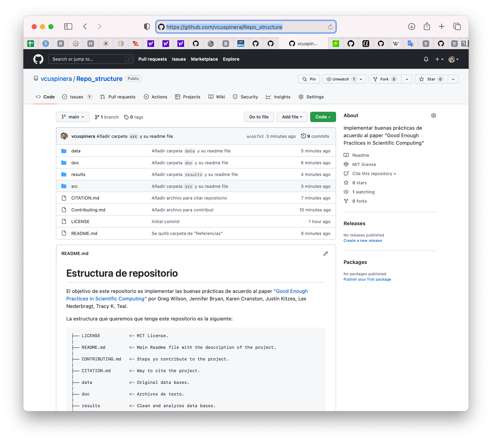

# 11 • Estructura de repositorio
*Ejercicio con base en paper "Good Enough Practices in Scientific Computing"*

El objetivo de esta actividad es identificar cuáles son las buenas prácticas que podemos implementar al trabajar la estructura de nuestro repositorio según las recomendaciones del paper de buenas prácticas para la computación científica.

## Contenido
1. Crear repositorio
2. Archivos recomendados
3. Carpetas recomendadas
4. Resultado
5. Referencias

## 1. Crear repositorio
Inicialmente habrá que crear un repositorio al que le nombraremos `Repo_structure`, y añadir una descripción.

> Lo anterior de acuerdo al paper en la sección 2.4. Give functions and variables meaningful names. _Nota: aunque no es una variable, recomiendo dar al repositorio también un nombre significativo y fácil de entender_

Al crear el repositorio, seleccionar las opciones
- `Public`

- `README.md`

> 3.1. Create an overview of your project.

- Añadir una licencia, en específico `MIT License`

> 3.3. Make the license explicit.

Posteriormente dar click en el botón `Create repository`.

## 2. Archivos recomendados
Posteriormente habrá que realizar lo siguiente:

### `README.md`

Actualizar archivo `README.md` del directorio raíz, añadiendo un título más significativo, una descripción del repositorio, y la estructura que queremos que tenga el mismo. Por ejemplo:

```
# Estructura de repositorio

El objetivo de este repositorio es implementar las buenas prácticas de acuerdo al paper ["Good Enough Practices in Scientific Computing"](https://arxiv.org/abs/1609.00037) por Greg Wilson, Jennifer Bryan, Karen Cranston, Justin Kitzes, Lex Nederbragt, Tracy K. Teal.

La estructura que queremos que tenga este repositorio es la siguiente:

    ├── LICENSE           <- MIT License.  
    |  
    ├── README.md         <- Main Readme file with the description of the project.  
    |  
    ├── CONTRIBUTING.md   <- Steps yo contribute to the project.  
    |  
    ├── CITATION.md       <- Way to cite the project.  
    |  
    ├── data              <- Original data bases.  
    |  
    ├── doc               <- Archivos de texto.  
    |  
    ├── results           <- Clean and analyzes data bases.  
    |  
    └── src               <- Coding files.  
```

> Lo anterior basado en la sección 3. Collaboration y 4. Project Organization.

### `CONTRIBUTING.md`

Añadir archivo `CONTRIBUTING.md` con el siguiente texto:

```
# Contributing
We love your input! We want to make contributing to this project as easy and transparent as possible, whether it's:

- Reporting a bug
- Discussing the current state of the code
- Submitting a fix
```

> Lo anterior basado en la sección 3.1. Create an overview of your project.

### `TO-DO` list

Abre un _Issue_ de nombre "TO-DO", y con el siguiente texto "Añadir archivos y carpetas recomendadas en paper de buenas prácticas de computación científica."

> 3.2. Create a shared public “to-do” list

### `LICENSE`

Revisar que en la raíz del repositorio tengas un archivo de nombre `LICENSE`.

> 3.3. Make the license explicit.

Además, revisar que en la sección del lado derecho aparezca uan opción que diga `MIT license`.

> 3.3. Make the license explicit. 2nd paragraph: "For software, we recommend a permissive open source license such as the MIT, BSD, or Apache license".

### `CITATION.md`

Añadir archivo `CITATION.md` con el siguiente texto:

```
# Citation

Please cite this work as:

YOUR_NAME_HERE. 2022. "Repo Structure". REPO_URL_HERE
```

Recuerden que deben personalizar el texto anterior cambiando `YOUR_NAME_HERE` por su nombre y `REPO_URL_HERE` por el link de su repositorio.

> 3.4. Make the project citable.

## 3. Carpetas recomendadas
Se deberán añadir las siguientes carpetas, y en cada una de ellas un archivo `README.md` con una breve descripción del objetivo de la carpeta.

### `doc`
Si trabajas directamente en el repositorio remoto GitHub, para añadir una carpeta desde la raíz del repositorio se debe dar click en `Add file`, seleccionar `Create new file` y poner el nombre de la carpeta que queremos añadir seguido de una línea diagonal y posteriormente el nombre del archivo que en este caso es `README.md`. En este caso se metería el siguiente nombre:

```
doc/README.md
```

Posteriormente, en el README file se podría añadir la siguiente descripción `Carpeta con archivos de texto`

> 4.2. Put text documents associated with the project in the `doc` directory.

### `data`, `results` y `src`

Al igual que en el punto anterior para la carpeta `doc`, se debería de crear una carpeta junto con su respectivo `README.md` file dentro de la cada carpeta, para cada uno de los siguientes puntos: `data`, `results` y `src`

Se puede poner el siguiente texto dentro del respectivo README.md file de cada carpeta:

- para `data`, escribir `Carpeta con bases de datos originales`,
- para `results`, escribir `Carpeta con bases de datos limpias y analizadas`, y
- para `src`, escribir `Carpeta con archivos de código`.

> Basado en las recomendaciones 4.3. Put raw data and metadata in a data directory, and files generated during cleanup and analysis in a results directory, y 4.4. Put project source code in the src directory.

## 4. Resultado

[Dar click aquí](https://github.com/vcuspinera/Repo_structure) para ver el repositorio creado como ejemplo donde se realizaron los puntos de esta actividad.

Y aquí se mira como imagen la estructura:



## 5. Referencias
- Wilson, G., Bryan, J., Cranston, K., et al. (2016). ["Good Enough Practices in Scientific Computing"](https://github.com/vcuspinera/UDG_MCD_Project_Dev_II/tree/main/actividades/material/Papers).
