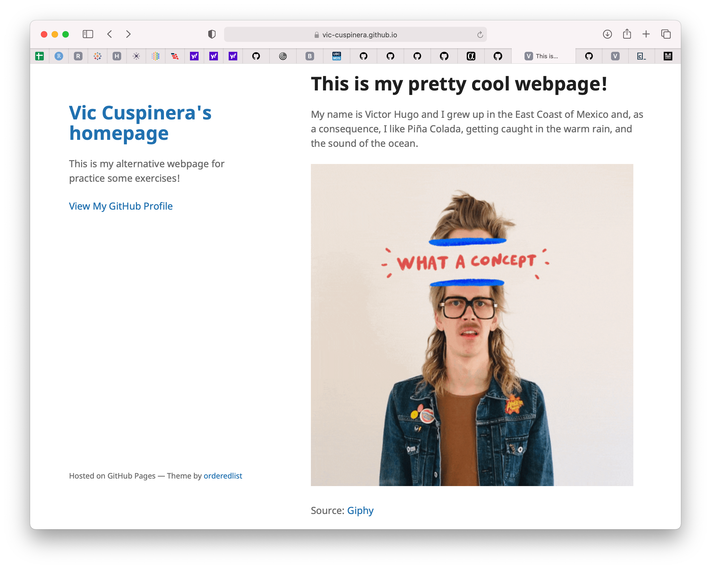

# 14 • GitHub personal webpage
*Crear una página web personal -básica- en GitHub*

Git es una herramienta utilizada para trabajar de forma local (en equipo propio) el sistema de control de versiones, y GitHub de forma remota (web). En esta actividad crearemos una página web personal muy básica en GitHub.

## Contenido
1. Crear el repositorio
2. Ajustes
3. Editar página principal
4. Configurar YML
5. Resultado
6. Referencias


## 1. Crear el repositorio
El primer paso es crear un repositorio con el nombre `username.github.io` donde `username` es su usuario en GitHub. Por ejemplo, para Jorge Gómez cuyo GitHub username es `joregc`, el repositorio se deberá llamar `joregc.github.io`

Al momento de crear el repositorio seleccionar las opciones `Public` y añadir un `README file`.

## 2. Ajustes
⚠️ Esta parte es muy importante.

Una vez creado el repositorio, deberás seguir los siguientes pasos:

- seleccionar la opción de `Settings`,
- en la sección "Code and automation" de la barra lateral, dar click en `Pages`,
- en la sección "Build and deployment", para "Source" seleccionar la opción `Deploy from branch`,
- en la sección "Build and deployment", para "Branch" seleccionar `main` y `root`,

## 3. Editar página principal
Una vez realizado lo anterior, abrir el README.md file principal ubicado en el directorio raíz del repositorio.

Editar la página añadiendo:
- un título,
- texto en el cuerpo del archivo, y
- una imagen junto con su fuente.

A manera de ejemplo, en mi caso modifiqué el README.md dejando el siguiente texto:

```
# This is my pretty cool webpage!

My name is Victor Hugo and I grew up in the East Coast of Mexico and, as a consequence, I like Piña Colada, getting caught in the warm rain, and the sound of the ocean.


Source: [Giphy](https://giphy.com/gifs/idea-concept-what-a-wVmVnHNvdHBPSWMB9r)
```

Una vez realizado estos cambios puedes revisar tu página en `https://username.github.io` donde username es tu nombre de usuario en GitHub. La actualización de esta página puede tomar algunos minutos.

## 4. Configurar YML
Por default, el título de la página es `username.github.io`, sin embargo, se puede cambiar añadiendo/editando el archivo `_config.yml` el cual se ubica en el directorio raíz del repositorio.

Para esto, se deberá:
- crear archivo `_config.yml` (en caso que este archivo exista por default, se daría click en `editar`),
- añadir el siguiente código, personalizando las opciones `title` y `description`:

```
theme: jekyll-theme-minimal
title: NOMBRE_DE_TU_PAGINA_WEB
description: BREVE_DESCRIPCION_DE_TU_PAGINA
```

- dar un nombre y descripción a los cambios, y dar click en `Commit changes`

## 5. Resultado
Puedes ver el resultado final desde la página `https://username.github.io` donde username es tu nombre de usuario en GitHub.

Por ejemplo, yo hice la siguiente página https://vic-cuspinera.github.io la cual se observa así:



⚠️ __Nota:__ existen distintas plantillas (_templates_) que tienen distintos formatos con Jekyll para enriquecer su página web de GitHub, sin embargo, esto no se verá dentro del curso.

## 6. Referencias
- [Quickstart for GitHub Pages](https://docs.github.com/en/pages/quickstart) publicado por GitHub Docs.
- [About GitHub Pages and Jekyll](https://docs.github.com/en/pages/setting-up-a-github-pages-site-with-jekyll/about-github-pages-and-jekyll) por GitHub Docs.
