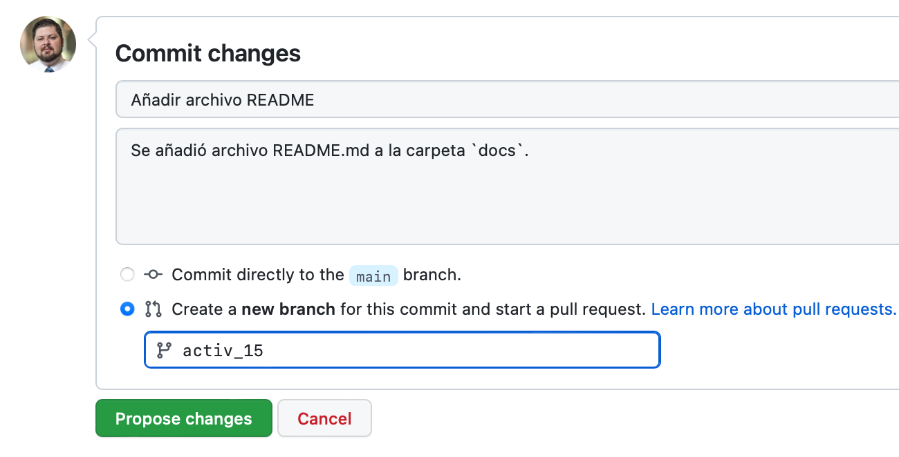

# 14 • Trabajando en equipo en GitHub
*Uso de pull requests y branches para el trabajo en equipo en GitHub*

Git es una herramienta utilizada para trabajar de forma local (en equipo propio) el sistema de control de versiones, y GitHub de forma remota (web). Revisaremos el uso de pull requests y branches para el trabajo en equipo en GitHub.

## Contenido
1. Intro
2. Branches
3. Pull requests
4. Comandos git en la terminal
5. Referencias

## 1. Intro
Hasta ahora, al interactuar en GitHub hemos trabajado directamente en la carpeta principal (`main`) sin necesidad de solicitar la aprobación de cambios o trabajar en una rama paralela. En esta actividad se mencionará como trabajar en equipo de manera más segura utilizando `pull requests` y `branches`.

Como lo menciona Tiffany Timbers (2020), un proyecto se vuelve complejo si tiene al menos uno de los siguientes puntos:
- dos o más personas trabajan directamente en el análisis,
- un proyecto que tiene dos o más archivos de código,
- el proyecto utiliza grandes bases de datos, y
- el proyecto se trabaja de forma remota.

Hay distintas formas de resolver estas complejidades, y entre ellas se encuentra el trabajar con software de versión de controles, como GitHub.

## 2. Branches
Es una herramienta en la cual, se crea una rama paralela a la vertiente principal del proyecto en la cual se puede trabajar y posteriormente se utiliza para consolidar el trabajo en la rama principal `main`.

1. Para esta actividad trabajaremos utilizando el repositorio que previamente crearon con nombre de `hello`.

2. El compañero que había realizado un comentario previamente en este repositorio deberá crear un archivo README file dentro de la carpeta `docs`, añadiendo un título al archivo y una pequeña descripción. En caso de no existir esta carpeta, el compañero deberá crearla junto con el archivo. Al momento de añadir hacer el commit habrá que seleccionar la opción __" Create a new branch for this commit and start a pull request. Learn more about pull requests."__ y darle el nombre de "activ_15" al branch que se creará. Posteriormente dar click en el botón verde "Propose new file".

3. El dueño de la carpeta del proyecto "hello" al dar click sobre el botón que dice el nombre del branch `main` podrá ver todos los branches creados, y ahí encontrará el nuevo branch `activ_15` donde el compañero realizó cambios al repositorio, los cuales no se han incorporado.

## 3. Pull requests
4. Para poder incorporar los cambios de esta branch en el repositorio principal, el dueño del proyecto dará click sobre la opción `Pull requests` donde verá en amarillo un mensaje sobre la creación de la nueva branch y del lado derecho un botón verde que dice `Compare and pull request`, donde dará click.

5. Se abrirá una ventana en la que al calce podrá ver los cambios que se proponen hacer en el repositorio. Si estás de acuerdo con los cambios propuestos, deberás escribir un mensaje y dar click en el botón verde `Create pull request`.

6. Una vez que GitHub haya identificado si no hay algún problema en el archivo, como vimos con los conflictos en la [actividad 09](https://github.com/vcuspinera/UDG_MCD_Project_Dev_I/blob/main/actividades/09_GitHub_conflict.md), aparecerá un botón verde que dice `Merge pull request` en el que se deberá dar click, y posteriormente en `Confirm merge`.

7. Una vez realizado esto, aparecerá en color morado un mensaje que dice "merged", con lo cual los cambios han sido aceptados en el branch principal del repositorio: `main`.

## 4. Comandos de git en la terminal

A continuación se comparten algunos de los comandos de git más utilizados cuando se crean y trabajan en ramas paralelas a la rama principal del repositorio:

- `git branch`: sirve para ver todas las ramas (*branches*) del repositorio. De forma análoga se puede utilizar el código `git branch --list`
- `git branch <new_branch>`: crea una nueva rama con el nombre "new_branch".
- `git branch -d <branch>`: borra la rama de forma segura una vez que se ha fusionado con la rama principal `main`.
- `git branch -D <branch>`: borra la rama aún cuando no haya sido fusionada con la rama principal `main`.
- `git branch -m <new_name_branch>`: renombra la rama actual con el nombre "new_name_branch".
- `git checkout <other_branch>`: cambia de la rama actual a la rama de nombre "other_branch".
- `git checkout -b ＜new_branch＞`: crea uan nueva rama de nombre "new_branch" y se cambia a esta nueva rama creada.

## 5. Referencias
- [Timbers, T. (2020). "Lecture 1 - Intro to Data Science Workflows". Course DSCI 522 Data Science Workflows. MDS public material. UBC.](https://github.com/UBC-MDS/DSCI_522_dsci-workflows/blob/master/lectures/01_lecture-intro-to-ds-workflows.ipynb)
- [Atlassian. (2023). "Software Development: Learn Git, Git Branch".](https://www.atlassian.com/git/tutorials/using-branches/git-checkout)
